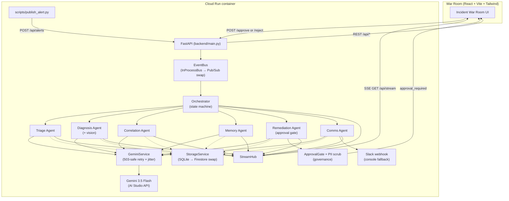
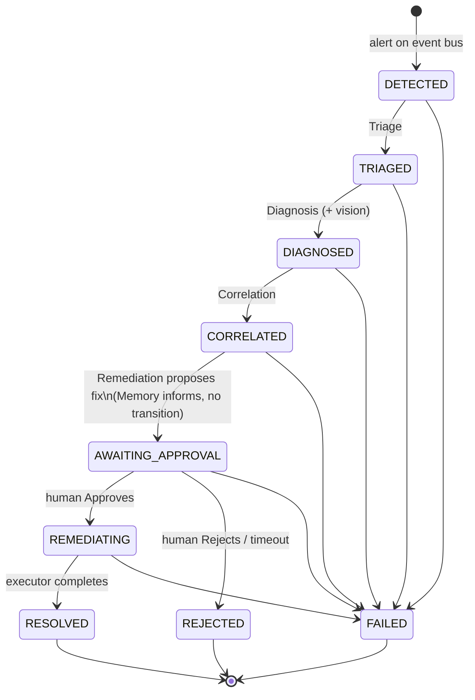

# AegisOps — Architecture

AegisOps is an event-driven, multi-agent incident-response system. One
orchestrator routes a production alert through six scoped sub-agents, each of
which reasons with Gemini 3.5 Flash through a single 503-safe access layer,
persists to SQLite, and streams every step to a React war room over SSE. The
whole backend is packaged into one container and wrapped by Cloud Run.

---

## Component breakdown

| Component | Module | Responsibility |
|---|---|---|
| **FastAPI app** | `backend/main.py` | REST API, SSE endpoints, event-bus wiring, static frontend mount. The lifespan chooses the local storage/bus impls. |
| **Config** | `backend/config.py` | Loads `.env` once via `pydantic-settings`. Single source of every secret/tunable. |
| **Event bus** | `backend/services/eventbus.py` | `EventBus` interface + `InProcessBus` async fan-out. Swap seam for Pub/Sub. |
| **Orchestrator** | `backend/orchestrator.py` | Constructs the incident, advances the state machine, hands the shared `RunContext` to each agent in turn. |
| **Agent runtime** | `backend/agents/base.py` | `BaseAgent` + `RunContext`. `think()` (retry-wrapped Gemini), `tool()`, `remember()`, `transition()`, `emit()` — every call auto-audits and auto-streams. |
| **Sub-agents** | `backend/agents/*.py` | Triage, Diagnosis, Correlation, Memory, Remediation, Comms — each its own prompt, tools, scope. |
| **Tools** | `backend/tools/*.py` | Deterministic, non-LLM work (deploy queries, log fetch, memory search, remediation planner/executor, ticket filer). |
| **Gemini service** | `backend/services/gemini.py` | The single choke-point for every model call. Exponential-backoff-with-jitter retry, token/latency accounting, vision (inline image Part). |
| **Storage** | `backend/services/storage.py` | `StorageService` interface + `SQLiteStorage`. Incidents, deploys, logs, memory, registry, audit log. Swap seam for Firestore. |
| **Stream hub** | `backend/services/stream.py` | In-process broadcast + replay ring buffer. Fans every `StreamEvent` to all connected SSE clients. |
| **Guardrails** | `backend/guardrails.py` | `ApprovalGate` (asyncio handshake) + `scrub_pii` PII redactor. |
| **Embedding** | `backend/services/embedding.py` | Local vector embedding for incident-memory similarity. |
| **Slack** | `backend/services/slack.py` | Real webhook post; explicit console fallback when unconfigured. |
| **Seed / fixtures** | `backend/seed/` | `seed_data.py` (deploys, logs, memory, registry) + `generate_grafana.py` (headless matplotlib Grafana snapshot). |
| **Frontend** | `frontend/` | React + Vite + TypeScript + Tailwind war room. Consumes REST + SSE. Built to `frontend/dist`. |
| **Publisher** | `scripts/publish_alert.py` | Fires the demo alert at `POST /api/alerts`. |

---

## System diagram

Every agent's `think()` call goes through `GeminiService` (never the SDK
directly), and every `think()`/`tool()` call simultaneously writes an audit row
to `StorageService` and emits a `StreamEvent` to the `StreamHub` — so the audit
log (durable) and the SSE stream (live) both receive every step.

---

## Incident state machine

The Orchestrator advances the detection phases; the Remediation agent owns the
approval-gate transitions (it is the only component that knows the gate outcome).
Transitions are validated against `LEGAL_TRANSITIONS` in `backend/models.py` —
any state can also fail into `FAILED`.

Note the Memory agent runs between `CORRELATED` and `AWAITING_APPROVAL` but does
**not** move the state machine — it enriches the shared findings that the
Remediation agent then reasons over. Comms always runs after Remediation to
close the loop, whether the incident `RESOLVED` or was `REJECTED`.

---

## Governance layer

This is the architecture-score differentiator (spec §2). Four mechanisms:

### Approval gate
`backend/guardrails.py :: ApprovalGate`. A per-incident asyncio handshake — not
a polled flag. The Remediation agent transitions to `AWAITING_APPROVAL`, opens
the gate, emits `approval_required`, then **awaits** `gate.wait_for(...)`. The
coroutine is physically suspended until a human POSTs to
`/api/incidents/{id}/approve` (or `/reject`), which calls `gate.resolve(...)`.
A 10-minute timeout is treated as a hold — **never** an auto-approval, so a
destructive action never runs without an explicit human yes.

### PII scrub ("Model Armor", self-implemented)
`backend/guardrails.py :: scrub_pii`. Before the Comms agent posts to Slack it
redacts emails, IPs, card numbers, API tokens, JWTs, and phone numbers via
regex, returning both the scrubbed text and a redaction count that is recorded
honestly in the incident findings.

### Full audit trail
`backend/services/storage.py` (`audit_log`). Every `think()` and `tool()` call
in `RunContext` persists an `AuditStep` — agent, step, input, reasoning, tool
call, output, token estimate, latency — durable and queryable at
`GET /api/incidents/{id}/audit`. The same event is streamed live.

### Agent registry
`backend/seed/seed_data.py`, stored in the `agent_registry` table and served at
`GET /api/registry`. Lists each agent's name, version, model, allowed tools, and
scope — surfaced in the UI's registry drawer so the agent lineup and its
permitted tools are transparent.

---

## Cloud portability

The `StorageService` and `EventBus` interfaces are the seam. Their local
implementations (`SQLiteStorage`, `InProcessBus`) are selected in exactly one
place — the FastAPI lifespan in `backend/main.py`. Writing
`FirestoreStorage(StorageService)` and `PubSubBus(EventBus)` and changing those
two constructor lines moves the system onto managed GCP with no change to the
agents, orchestrator, or publisher. The SQLite tables mirror the future
Firestore collections one-to-one (spec §4).

---

## Deployment

The backend is packaged as a single container (`docker/Dockerfile`): a Node 20
stage builds the frontend to `frontend/dist`, and a Python 3.11-slim stage
installs `backend/requirements.txt`, copies `backend/`, `scripts/`, and the built
`dist`, then runs `uvicorn backend.main:app`. FastAPI serves the compiled
frontend from `/` (mounted last so `/api/*` wins), so one Cloud Run service
hosts both the API and the war room. matplotlib renders the seed Grafana
snapshot headlessly via the `Agg` backend, so no display is required in the
container. `deploy.sh` ships it to Cloud Run and injects secrets from `.env` as
env vars at deploy time — never baked into the image.
