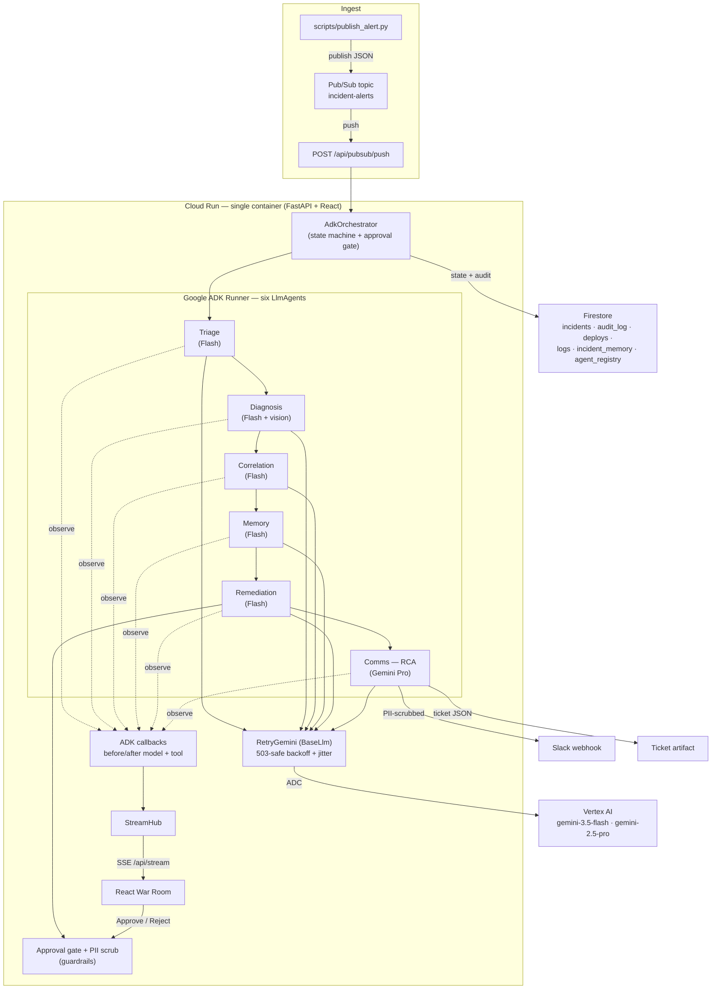
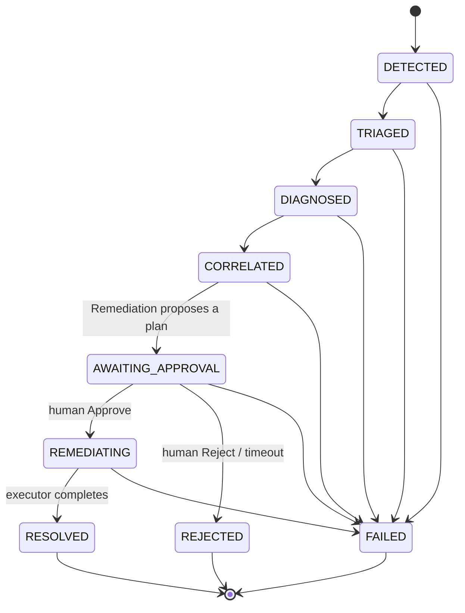

# AegisPilot — Architecture

AegisPilot is an autonomous, multi-agent SRE on-call system. An alert enters through
**Pub/Sub**, a **Google ADK `Runner`** orchestrates six specialized **`LlmAgent`s** on
**Vertex AI** (Gemini 3.5 Flash, + Gemini Pro for the RCA), state and the full audit
trail persist to **Firestore**, and every reasoning step streams over **SSE** to a React
"Incident War Room". It runs on **Cloud Run**. A single human approval gate governs any
destructive action.

---

## 1. System diagram



---

## 2. Incident state machine

The orchestrator advances the detection phases; the **Remediation** agent owns the
approval-gate transitions (only it knows the human's decision). Illegal transitions are
rejected by `LEGAL_TRANSITIONS` in `backend/models.py`.



> The **Memory** agent runs between Correlation and Remediation to inform the plan but
> does **not** move the state machine.

---

## 3. Components (mapped to real modules)

| Concern | Module | Notes |
|---|---|---|
| **Orchestration (ADK)** | `backend/adk/orchestrator.py` | Runs each `LlmAgent` via a real ADK `Runner`; normalizes findings from captured tool outputs; owns the state machine + gate |
| **Agents (ADK)** | `backend/adk/agents.py` | Six `LlmAgent`s; five on Flash, Comms on Pro |
| **Model reliability** | `backend/adk/retry_llm.py` | `RetryGemini(BaseLlm)` wraps every ADK model call in backoff+jitter |
| **Observability** | `backend/adk/callbacks.py` | before/after model+tool callbacks → SSE + audit; captures tool outputs |
| **Tools** | `backend/adk/tools.py`, `backend/tools/*` | Real deterministic functions as ADK `FunctionTool`s (executor **not** exposed) |
| **Model access** | `backend/services/gemini.py` | Vertex (ADC) or AI Studio (key); per-call model override for the Pro tier |
| **Storage** | `backend/services/storage.py` (SQLite) · `firestore_storage.py` | Behind `StorageService`; select via `BACKEND` |
| **Event bus** | `backend/services/eventbus.py` (in-proc) · `pubsub_bus.py` | Behind `EventBus`; pull (local) or push (Cloud Run) |
| **Streaming** | `backend/services/stream.py` | In-process broadcast hub → SSE, with replay for late joiners |
| **Governance** | `backend/guardrails.py` | Async approval gate + PII scrubber |
| **Local fallback** | `backend/orchestrator.py`, `backend/agents/*` | Custom orchestrator kept selectable via `ORCHESTRATOR=local` |
| **Frontend** | `frontend/` | React + Vite + TS + Tailwind war room (agent graph, reasoning stream, vision overlay, approval modal, RCA/timeline, registry) |

---

## 4. Governance layer (the differentiator)

- **Human-in-the-loop approval gate** — `RemediationAgent` transitions the incident to
  `AWAITING_APPROVAL`, opens an `asyncio` gate, emits `approval_required`, and **blocks**
  on `gate.wait_for`. Only an explicit human *Approve* (via `POST /api/incidents/{id}/approve`)
  resumes it into `REMEDIATING`. The **destructive executor runs only in the orchestrator**,
  never as a model-callable tool — the LLM can plan but cannot act on its own.
- **PII scrubber ("Model Armor")** — everything bound for Slack is passed through
  `scrub_pii` (emails, IPs, tokens, JWTs, cards, phones) before egress. The full RCA stays
  internal (ticket + UI); Slack gets a concise, scrubbed card.
- **Full audit trail** — every step (input, reasoning, tool call, output, tokens, latency)
  is written to the `audit_log` collection **and** streamed live. Nothing is hidden.
- **Agent registry** — each agent's version, model, allowed tools, and scope live in the
  `agent_registry` collection and render in the UI drawer.

---

## 5. Reliability & cloud-portability

- **503-safe everywhere.** Vertex throttles under load; every call (ADK `RetryGemini` and
  local `GeminiService`, Flash and Pro) retries with exponential backoff + jitter. A slow
  retry runs in a worker thread so the event loop / SSE never blocks.
- **One line swaps cloud ↔ local.** `BACKEND=cloud|local` selects
  `FirestoreStorage`/`PubSubBus` vs `SQLiteStorage`/`InProcessBus`; `ORCHESTRATOR=adk|local`
  selects the ADK Runner vs the custom orchestrator. Both implementations ship in the repo.
- **Cloud Run specifics.** `PUBSUB_MODE=push` makes Pub/Sub deliver to `/api/pubsub/push`
  (correct for scale-to-zero); the deploy uses `--no-cpu-throttling --min-instances 1` so
  the async, approval-gated pipeline keeps CPU between requests. Auth is the runtime service
  account's ADC — **no keys in the image**.

---

## 6. Data model (Firestore collections ≙ SQLite tables)

```
incidents(id, status, severity, service, blast_radius, detected_at, probable_cause,
          confidence, remediation_plan, approved_by, resolved_at, rca_doc, fingerprint,
          findings, alert)
deploys(id, service, version, deployed_at, deployed_by, commit_sha, rollback_target)
logs(id, service, ts, level, message, log_class)
incident_memory(fingerprint_id, fingerprint, embedding, past_incident_ids,
                typical_cause, typical_fix, avg_resolution_minutes)
agent_registry(id, name, version, model, allowed_tools, scope, status)
audit_log(id, incident_id, agent, step, input, reasoning, tool_call, output,
          tokens, latency_ms, ts)
```

Memory similarity is a real cosine over locally-computed feature-hashed fingerprint
vectors (`backend/services/embedding.py`) — zero extra API cost, genuine clustering.
